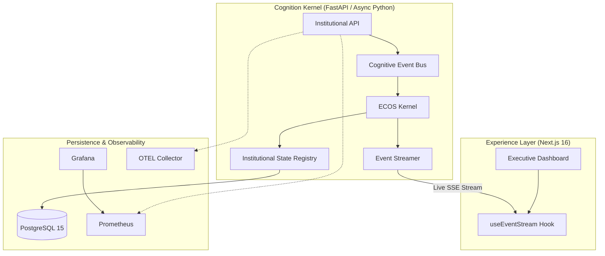
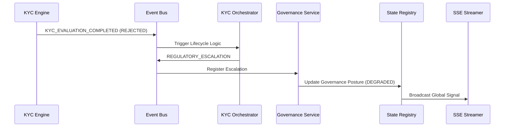

# ESOTERIC BANK | Intelligence Platform
### Institutional Governance • Real-time Cognition • Executive Experience


ESOTERIC BANK is a high-density institutional intelligence platform designed for executive oversight, regulatory governance, and real-time operational awareness. It transforms raw banking telemetry into governed institutional cognition.

---

## 🏛️ Institutional Architecture

The platform is powered by the **Enterprise Cognition Operating System (ECOS)**, a reactive kernel that orchestrates institutional state across distributed domains.



### Core Stack
- **Experience Layer**: Next.js 16 (App Router), TypeScript Strict, Tailwind CSS 4, Framer Motion.
- **Cognition Kernel**: FastAPI, Async Python 3.11, Pydantic v2.
- **Persistence Layer**: PostgreSQL 15 (Optimized for institutional consistency).
- **Observability**: OpenTelemetry (OTEL), Prometheus, Grafana.
- **Orchestration**: Docker Unified Enterprise Runtime.

---

## 🧠 Governance Intelligence System

The Governance Layer enforces institutional guardrails through autonomous drift detection and reactive escalation workflows.



- **Cognition Aggregator**: Centralizes signals from KYC, AML, and Treasury domains.
- **Drift Detection**: Real-time monitoring of policy variance and compliance slippage.
- **Regulatory Escalation**: Event-driven workflow orchestration (PENDING → EVALUATING → ESCALATED).
- **Audit Traceability**: Cryptographic-grade audit logging for every institutional action.

---

## 📡 Real-time Cognition & SSE

The platform utilizes a reactive event-driven architecture to propagate institutional intelligence instantly.

```text
[KYC Engine] -> (CognitiveEvent) -> [ECOS Event Bus] -> [State Registry]
                                                                ↓
[Executive Dashboard] <- (Live SSE Stream) <- [Institutional Bridge]
```

- **Forensic Measurement**: Hardened Recharts integration with `ResizeObserver` synchronization.
- **Silent Runtime**: Zero-warning hydration and dimension stability.
- **Event Consistency**: Trace ID propagation from API ingress to dashboard rendering.

---

## 🎮 Executive Scenario Console

Operators can validate institutional resilience through the built-in Simulation Engine.

- **KYC Injection**: Simulate high-risk customer evaluations and blockages.
- **Governance Spikes**: Inject synthetic drift into treasury or compliance domains.
- **Operational Surges**: Simulate kernel-level resource anomalies.

---

## 📊 Deployment & Orchestration

The entire platform is provisioned via a unified Docker Enterprise Runtime.

### Startup
```bash
# 1. Initialize environment
cp .env.example .env

# 2. Launch institutional runtime
docker compose up -d
```

### Access Matrix
| Interface | Endpoint | Authorization |
|---|---|---|
| **Experience Layer** | `http://localhost:3000` | `TIER_4_BOARD` |
| **Cognition API** | `http://localhost:8000/docs` | Institutional |
| **Grafana Core** | `http://localhost:3002` | `admin/esoteric_admin` |
| **Prometheus Node** | `http://localhost:9090` | System |

---

## 🛡️ Engineering Philosophy

1. **No Mock Theater**: Every UI component is wired to real backend cognition APIs.
2. **Event-Driven**: Decoupled domain services communicating via institutional event buses.
3. **Forensic Observability**: End-to-end trace continuity and cryptographic audit trails.
4. **Cinematic Density**: High-information density designed for institutional command centers.

---

## 🗺️ Roadmap
- **Wave 6**: Multi-region Treasury real-time settlement forecasting.
- **Wave 7**: Federated KYC cognition across institutional clusters.
- **Wave 8**: OIDC/SAML Hardware Security Module (HSM) integration.

---

**Akash Sharma**
Senior Software Engineer • AI Systems • Institutional Architecture
