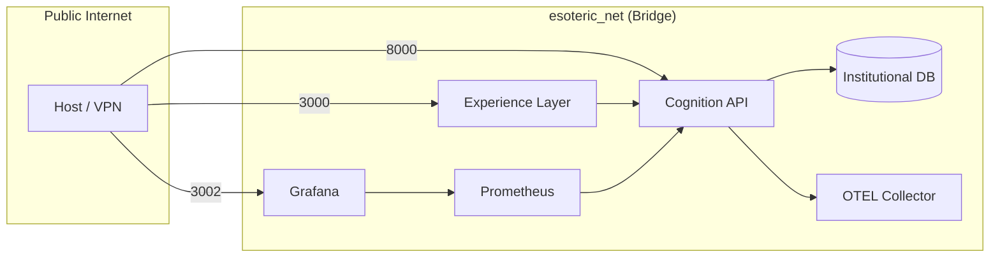

# ESOTERIC BANK | Institutional Deployment Topology

This guide details the orchestration and deployment procedures for the ESOTERIC BANK Unified Enterprise Runtime.

---

## 1. Container Topology

The platform is orchestrated using a multi-service Docker configuration, ensuring network isolation and institutional resilience.



| Service | Image | Role | Port | Healthcheck |
|---|---|---|---|---|
| **`experience-layer`** | `node:20-alpine` | Next.js Frontend | `3000` | `/health` (wget) |
| **`api`** | `python:3.11-slim` | FastAPI Backend | `8000` | `/platform/health` |
| **`db`** | `postgres:15-alpine` | Persistence | `5433` | `pg_isready` |
| **`prometheus`** | `prom/prometheus` | Metric Ingestion | `9090` | Liveness |
| **`grafana`** | `grafana/grafana` | Visualization | `3002` | Liveness |
| **`otel-collector`** | `otel/opentelemetry` | Telemetry Sink | `4317` | Liveness |

---

## 2. Network Architecture

All institutional services are connected via the `esoteric_net` bridge network.

- **Isolation**: Internal database and telemetry ports are not exposed to the host unless explicitly mapped.
- **Service Discovery**: The backend API connects to the database via its service name (`db:5432`).
- **IPv4 Hardening**: Healthchecks are configured to use `127.0.0.1` to bypass container resolution mismatches.

---

## 3. Deployment Workflow

### Prerequisites
- Docker Engine 24.x+
- Docker Compose v2.x+
- Institutional Credentials (managed via `.env`)

### Procedure
1.  **Initialize Environment**:
    ```bash
    cp .env.example .env
    # Edit .env with institutional secrets
    ```
2.  **Launch Stack**:
    ```bash
    docker compose up -d --build
    ```
3.  **Verify Liveness**:
    ```bash
    docker compose ps
    ```
    *All containers should reach `healthy` status within 45s.*

---

## 4. Observability Integration

The deployment automatically provisions a complete monitoring stack.

### Grafana Provisioning
- **Datasources**: Prometheus is pre-configured as the default institutional source.
- **Dashboards**: The `Executive Oversight` dashboard is auto-loaded from `./docker/grafana/provisioning/dashboards`.
- **Telemetry Flow**: The `api` service exports traces to `otel-collector:4317` using the OTLP/gRPC protocol.

---

## 5. Persistence & Recovery

- **Durable Storage**: PostgreSQL data is persisted in the `postgres_data` volume.
- **Auto-Restart**: Services use `restart: always` to recover from transient kernel panics or resource spikes.
- **Initialization**: Database schemas and seed data are automatically injected from `./sql` on the first container boot.
