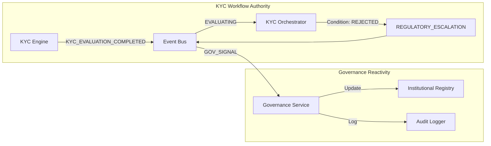
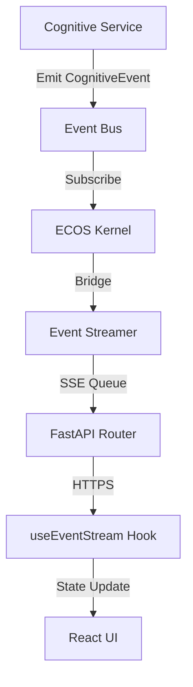

# ECOS Architecture & Governance Intelligence

This document details the **Enterprise Cognition Operating System (ECOS)** and the underlying governance intelligence layer powering the ESOTERIC BANK platform.

---

## 1. Enterprise Cognition Operating System (ECOS)

ECOS is a reactive, event-driven kernel that manages institutional state, service coordination, and real-time intelligence propagation.

### Architecture Overview
- **Institutional State Registry**: Centralized thread-safe storage for cross-domain state (Governance, Risk, Tasks, System).
- **Runtime Coordinator**: Orchestrates asynchronous cognitive tasks and manages service discovery/liveness.
- **Event Bus Architecture**:
    - **ECOS Bus**: High-performance internal bus for orchestration events.
    - **Cognitive Bus**: Institutional-grade bus for domain-specific intelligence (KYC, AML, Governance).
- **Institutional Bridge**: Synchronizes internal kernel state with the external Experience Layer via high-frequency SSE streaming.

---

## 2. Governance Intelligence Flow

Governance is implemented as a reactive layer that monitors institutional state and enforces policy guardrails.

### Workflow: Regulatory Escalation
1. **Detection**: The KYC Risk Engine or Drift Detector emits a `CognitiveEvent` to the Cognitive Bus.
2. **Orchestration**: The `KYCLifecycleOrchestrator` captures the event and evaluates transition rules.
3. **Escalation**: If critical thresholds are breached, a `REGULATORY_ESCALATION` is emitted.
4. **Reactivity**: The `GovernanceIntelligenceService` registers the escalation in the institutional ledger.
5. **Propagation**: The ECOS Kernel synchronizes the state and pushes a live update to the Executive Dashboard.
6. **Audit**: The `InstitutionalAuditLogger` records the entire chain with cryptographic checksums for forensic review.

---

## 3. Real-time Event Propagation

The platform ensures sub-100ms latency from backend signal to frontend visualization.

### SSE Propagation Path
- **Ingress**: Cognitive Service (e.g., KYC Engine).
- **Processing**: ECOS Kernel (`handle_cognitive_event`).
- **Distribution**: `CognitiveEventStreamer` (asyncio.Queue).
- **Egress**: FastAPI SSE Route (`/observability/stream`).
- **Visualization**: React `useEventStream` Hook -> Framer Motion -> Dashboard.

---

## 4. Observability & Traceability

Institutional observability is enforced through a multi-tier telemetry stack.

- **Trace Propagation**: Trace IDs are captured at the API gateway and embedded into every downstream `CognitiveEvent` and `AuditEntry`.
- **OTEL Integration**: Traces are exported via OTLP to a central collector for institutional analysis.
- **Metric Scraping**: High-resolution metrics (CPU, Latency, Evaluation Velocity) are scraped by Prometheus every 15s.
- **Executive Dashboards**: Grafana core provisioned with pre-configured oversight dashboards.

---

## 5. Security & Governance Standards

- **Identity**: Operators are assigned institutional clearances (e.g., `TIER_4_BOARD`).
- **Audit**: Every action is cryptographically signed and immutable within the audit history.
- **Governance Drift**: Automatic detection of variance between institutional policy and real-world state.
